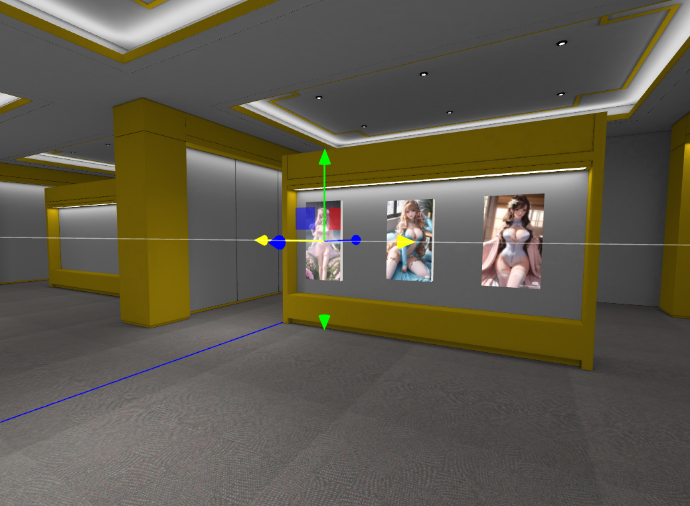

# 基于 threejs 的 3D 展厅

基于 threejs 开发的 3D 展厅，展品可以自由摆放。支持 gltf/glb 格式

在线演示：http://test4.h5ds.com/

视频教程：https://www.bilibili.com/video/BV1pb4y13777/?spm_id_from=333.337.search-card.all.click



# 初始化实例

```javascript
// 实例化
const vr = new VR3DHall({
  debugger: true, // 开启调试模式，开启调试模式后可以选中展品，缩放，旋转，位移，console.log中可以查看到数据
  maxSize: 25, // 画框最大尺寸
  movieHight: 1.5,
  container: document.getElementById("root"), // 容器
  cameraOption: {
    // 初始视角
    position: { x: 0, y: 1.5, z: 0 },
    lookAt: { x: 3, y: 1.5, z: 3 },
  },
  onClick: (item) => {
    console.log("你点击了", item);
  },
});
```

# 加载厅模型

```javascript
// 加载厅模型
vr.loadHall({
  url: "./assets/room1/msg.gltf",
  planeName: "meishu01",
  position: { x: 2, y: -0.2, z: 2 },
  scale: 1,
  onProgress: (p) => {
    console.log("加载进度", p);
  },
});
```

# 加载其他模型和动画

```javascript
// 加载机器人
vr.loadGLTF({
  url: "./assets/robot/robot.glb",
  position: { x: 0, y: 0, z: 0 },
  rotation: { x: 0, y: -Math.PI / 2, z: 0 },
  scale: 0.2,
}).then((gltf) => {
  // 创建动画
  vr.createAnimate(gltf, { animateIndex: 0, duration: 5 });
});
```

# 加载展品数据

```javascript
/**
 * 画框数据
 * @params {
 *   id: '', // 唯一标识
 *   position: {x: 0, y: 0, z: 0},  // 模型位置
 *   rotation: {x: 0, y: 0, z: 0},  // 旋转角度
 *   view: {x: 0, y: 0, z: 0},  // 预览点的位置，移动到这里，看向position
 *   scale: {x: 0, y: 0, z: 0},  // 缩放比例
 *   name: '名字',  // 名字
 *   desc: '描述说明',  // 描述说明
 *   url: '资源url',  // 资源url
 *   type: 'picture',  // 'gltf' | 'picture' | 'dot'; // gltf模型，图画模型，图画要自定义画框
 *   boxColor: '#fff', // 画框颜色
 * }
 */
export const data = [
  {
    id: "1", // 唯一标识
    position: {
      x: -0.6593699553026159,
      y: 1.3866967899666711,
      z: 7.067726292206915,
    },
    scale: {
      x: 0.025612307671229958,
      y: 0.025612307671229958,
      z: 0.025612307671229958,
    },
    rotation: { x: 0, y: 0, z: 0 },
    view: { x: 0, y: 0, z: 0 }, // 预览点的位置，移动到这里，看向position
    name: "名字", // 名字
    desc: "描述说明", // 描述说明
    url: "/assets/pictures/1.jpg", // 资源url
    type: "picture", // 'gltf' | 'picture' | 'dot'; // gltf模型，图画模型，图画要自定义画框
    boxColor: "#fff", // 画框颜色
  },
];

// 加载画框数据
vr.loadItems(data);
```

# 导览

```javascript
// 切换到对应的展品ID的视角
vr.viewItem(itemId);
```

# 开启和关闭重力感应

开启关闭重力感应必须在 callback 后执行

```javascript
// 开启重力感应
vr.gravity.open();

// 关闭重力感应
vr.gravity.close();
```
